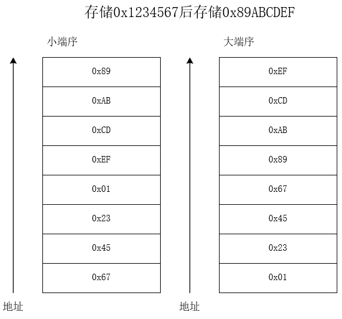

# 信息的表示和处理
## 信息存储
### 虚拟地址空间与程序对象
- **虚拟地址空间**
	- 操作系统为每个进程维护独立的虚拟地址空间，将内存划分为若干可管理的页或块。
	- 程序对象(程序数据、指令和控制信息)都映射到此虚拟地址空间中,具体物理内存由操作系统和MMU(内存管理单元)动态分配、映射和换入/换出。
	- 整个管理过程在虚拟地址层面完成，对程序透明。
- **程序对象与字节序列**
	- 在内存中、每个程序对象都可以看作连续的字节块，其首地址(对象地址)被定义为该字节块的最低虚拟地址。
	- 程序本身也是一段字节序列。可执行文件先被加载到虚拟内存中，再根据程序头(ELF/PE/Mach-o)进行各段的映射。
### C语言中的指针与类型信息
#### 指针的值
- 指针的值是目标对象在虚拟地址空间中的地址。
- 不同类型的之中呢在编译期间会带上指向类型的信息，用于在编译阶段进行类型检查和指针运算。
- 在生成的机器码层面，指针本质只是一个整型地址，并不包含类型信息。运行时无法凭指针本身判断指向对象的类型。
#### 指针的内存表示
- 在一个具体的编译目标下所有的指针都占用相同字节数。
	- 32位程序中，指针为4字节。
	- 64位程序中，指针为8字节。
- 该字节数与指针包含的类型信息无关。类型检查仅在编译器进行。
#### 类型与内存分配
- C编译器会根据指针类型生成不同的地址偏移。
- 运行时，类型对于指针运算与内存访问行为很重要。
## 数据字大小与数类型
### 数据字
- **字长**
	- 指处理器在内部运算时的自然单位，通常等于通用寄存器的位宽。
	- 字长决定了虚拟地址空间的理论最大范围。
- 向下兼容
	- 大多数64位处理器能以32位模式运行旧32位程序。
		- 不同编译目标下的位模式切换，与物理处理器本身无关。
### C语言中常见数据类型与大小

### C的数据类型与分配的字节数
| 数据类型      | ILP32 | LP64 | LLP64 |
| --------- | ----- | ---- | ----- |
| char      | 1     | 1    | 1     |
| short     | 2     | 2    | 2     |
| int       | 4     | 4    | 4     |
| long      | 4     | 8    | 4     |
| long long | 8     | 8    | 8     |
| float     | 4     | 4    | 4     |
| double    | 8     | 8    | 8     |
| pointer   | 4     | 8    | 8     |
| size_t    | 4     | 8    | 8     |
| int32_t   | 4     | 4    | 4     |
| int64_t   | 8     | 8    | 8     |
- **ILP32**
	- `long,pointer`为4字节。适用于传统32位系统。
- **LP64**
	- `long,pointer`为8字节，适用于大多数64位系统。
	- 如x64-64、UNIX、linux
- **LLP64**
	- `pointer`为8字节，`long`为4字节。
- size_t无符号。
### 可移植性与固定宽度整型
- C标准并未对各类型的大小给出上界，指规定了下界。($\text{short} \ge 16 \text{bit},\text{ int} \ge 16 \text{bit},\text{long} \ge 32 \text{bit}$)
- **ISO C99标准**引入了`stdint.h`，定义了固定宽度整数类型(int8_t、int16_t、int32_t、int64_t等)与最小宽度类型(int_leastN_t)。
	- 使用固定宽度整数类型可以使代码更加可一致。
- **格式化宏**
	- 在`inttypes.h`中定义了一系列格式化宏。与上述固定宽度类型配合使用。
		- 会根据目标平台的数据模型自动展开为正确的格式说明符。
	- 如`printf("a=%" PRId32 "\n",a)`
#### 常用的格式化宏
| 类型               | 宏名称    | 说明                                 |
| ------------------ | --------- | ------------------------------------ |
| `int8_t`           | `PRId8`   | 有符号 8 位十进制输出 (`%" PRId8 "`)    |
| `uint8_t`          | `PRIu8`   | 无符号 8 位十进制输出 (`%" PRIu8 "`)    |
| `int16_t`          | `PRId16`  | 有符号 16 位十进制输出 (`%" PRId16 "`)  |
| `uint16_t`         | `PRIu16`  | 无符号 16 位十进制输出 (`%" PRIu16 "`)  |
| `int32_t`          | `PRId32`  | 有符号 32 位十进制输出 (`%" PRId32 "`)  |
| `uint32_t`         | `PRIu32`  | 无符号 32 位十进制输出 (`%" PRIu32 "`)  |
| `int64_t`          | `PRId64`  | 有符号 64 位十进制输出 (`%" PRId64 "`)  |
| `uint64_t`         | `PRIu64`  | 无符号 64 位十进制输出 (`%" PRIu64 "`)  |
| `int32_t`/`int64_t`| `PRIx32`<br>`PRIx64` | 无符号十六进制小写输出 (`%" PRIx32 "`, `%" PRIx64 "`) |
| `int32_t`/`int64_t`| `PRIX32`<br>`PRIX64` | 无符号十六进制大写输出 (`%" PRIX32 "`, `%" PRIX64 "`) |

## 寻址方式和字节顺序
### 对象在内存中的表示
- **多字节对象连续存储**
	- 一个整数、浮点数、结构体等多字节对象在内存中会占用连续一段字节。
- **对不同类型的同一字节块重解释**
	- 可以通过强制类型转换或联合(union)将同一段字节块以不同类型来访问。
	- 需要注意**对齐**和**别名规则**，否则会出现未定义行为或性能损耗。
### 字节顺序
- 指多字节对象在内存中按照字节地址升序排列时，最低有效字节(LSB)与最高有效字节(MSB)所处的先后顺序。  
- 常见的两种规则
	- **小端序**
		- 内存地址从低到高依次存放最低有效字节到最高有效字节。
	- **大端序**
		- 内存地址从低到高依次存放最高有效字节到最低有效字节。

- 对多数高级语言程序员透明，因为编译器会自动插入正确的内存加载/存储指令。
- 在不同字节序机器之间通过网络或文件交换二进制数据时，需要注意**网络字节序**(定义为大端序)与主机字节序之间的转换。
- 通过指针访问内存的底层操作会暴露字节序差异。
- **union**复用内存时，要谨慎考虑字节序与对齐规则，狗则得到的值可能与预期不符。
### 对齐与填充
- **内存对齐**
	- 多字节对象通常需要按某个边界对齐(如4字节对齐、8字节对齐)才能获得最佳访问性能或满足硬件要求。
		- 结构体是`struct`应对齐到其内部最大成员对齐值。
	- 未对齐访问在某些架构上可能会导致性能下降，甚至引发硬件异常。
- **结构体内存布局与填充**
	- C编译器为保证成员按照对齐规则安置，通常会在结构体成员之间或末尾插入**填充字节**。
		- 使得每个类型占用的内存为边界值的倍数。
	- 跨平台代码中应注意不同编译器和架构上的默认对齐与打包规则。
### C标准的别名规则
#### 原因
- 编译器假设除非显式说明，否则不同类型的指针不会指向同一内存地址。
	- 将对同一内存的不同类型访问是为**相互独立**，不需要重新加载或存储另一个类型带来的改变。
	- 在寄存器缓存时省去同步其他类型视图的开销。
- 若存在不同类型指针访问相同内存，编译器可能会错误地优化，导致运行时行为不可预测。
#### 允许别名的情况
- 完全相同的类型
	- 如`int *`与`int *`
- C标准规定兼容的类型
	- 如标签、成员一致的结构体。
	- 同一个`enum`类型与其底层整型等价，但直接使用`enum`类型和指针别名仍不被允许，除非额外转换。
- 指向`signed`和`unsigned`同一宽度整型
- 指向一个类型的`_Bool`、`char`、`unsigned char`、`signed char`
	- 任何对象都可通过`char *`、`unsigned char *`、`signed char *`进行访问。
		- 被看作对原始二进制字节的逐字节检查。
		- 使用其访问任意对象保证安全，不违反严格命名规范。
- 指向`void*`与目标指针的相互转换
	- void*与其他指针类型在内存表示上是兼容的，但只能先转换到目标指针类型后再解引用。
	``` C
int x=1;
void *pv=&x;
int *pi=(int *)pv;//此时才能安全访问
	```
- 联合体(union)成员访问
	- 对同一个union中不同成员之间相互访问是被标准所允许的特殊别名情况。
	- C11及更高版本中，读取非当前活跃成员是未定义的情况(常被实现允许)。
		- 一个`union`变量在任意时刻只有一个**活跃成员**(最后一次被写入(赋值)的成员)。
		- 内存中的比特位会按照活跃成员的数据类型来解释。
#### 严格别名规则的具体要求
- 假设指针`T1 *p=addr;T2 *q=addr`。
- 必须满足以下条件之一
	- T1与T2完全相同或兼容。
	- T1和T2都是`signed/unsigned`形式的同宽整型。
	- T1和T2都是char、unsigned char、signed char、\_Bool
	- 其中一个是`void *`，但在实际解引用时应显示转换回目标类型。
	- 都指向同一个`union`的不同成员、且从C11角度讲只能读取最后写入成员，读取其他成员在标准中是为定义行为。(多数编译器允许查看原始比特)。
		- **原始比特**指`union`底层那段连续的存储单元，存储的哪些二进制位。
			- `union`的所有成员共用一块存储空间，不管写入了哪个成员，都会最终写入原始比特。
			- 原始比特在内存中不分左右地以字节序列的形式存在。
#### 违反的后果
- 编译器优化被破坏
	- 编译器可能将一个变量的值缓存到寄存器，不再重新从内存中加载。
	- 若其他类型指针通过不同类型写入该内存，预先缓存的值不会更更新导致读取到**过期数据**。
- 未定义行为
	- 该内存访问可能导致运行结果不符合预期，在不同的情况下结果可能不同。
- 难以调试
	- 依赖编译器的优化假设，调试时，单步执行或关闭优化可能正确执行，从而难以定位。