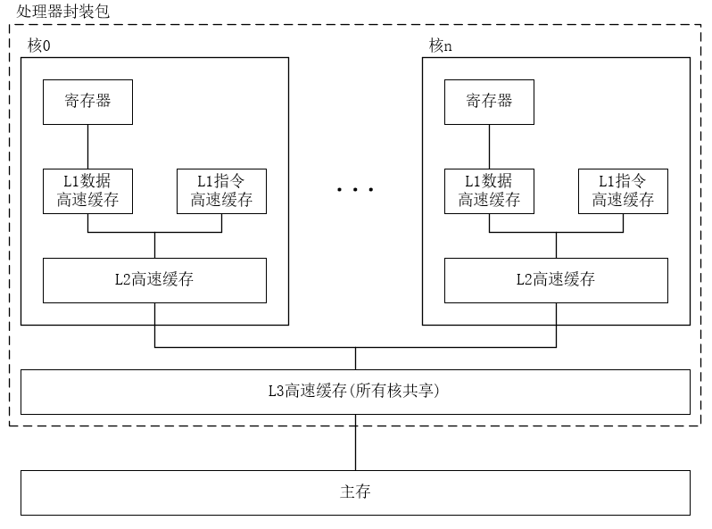

# 并发与并行
- **并发**
	- 同一时间段内系统中存在多个活动的任务。
	- 任务的执行可以交错进行，但不一定同时运行。
	- 并发关注任务的结构与交互。
- **并行**
	- 在多个处理器或核心上同时执行多个任务，实现真正意义上的同时运行。
	- 并行关注任务在硬件层面的同时执行。
## 线程级并发
### 单核系统
- 系统层面单核，强调核心数为1。不允许内部封装多个核心。
- 通过操作系统快速切换线程(如时间片轮转)实现并发。
- 虽然每时刻只有一个线程在运行，但通过快速切换可以隐藏阻塞和等待。
- **只能通过调度切换来实现并发**。
### 多核系统
- 系统层面多核，强调一个处理器封装了多个物理核心。
- 多核处理器将多个CPU集成到一个集成电路芯片上。
- **每个核心可独立调度线程，多个线程可以实现真正并行执行。**

- 每个核都有自己的L1 Cache和L2 Cache。其中L1 Cache分为保存指令和数据两个部分。
- 这些核共享更高层次的高速缓存以及到主存的接口。
#### 多处理器系统
- 强调系统层面封装数量，可装载多个CPU。
- 使用多个物理CPU(或多个芯片)来并行执行任务。
- 降低因单核切换带来的上下文切换开销。
- 通过多线程编程、可在线程间分配工作、实现高效并行。
### 超线程
- 是**一种硬件层面的技术**，是针对物理核心的，逻辑核心不算实际核心，因为执行单元仍然共享。在同一个物理核心上**暴露**多个逻辑核心，让多个硬件线程共享执行资源。
	- CPU微架构在物理核心内部，为每个逻辑核心准备了一套独立的架构状态(PC、通用寄存器组、控制寄存器、线程本地存储指针(TLS))。
- 每个逻辑核心拥有**独立的寄存器上下文**(PC、通用寄存器、控制寄存器等)，但**共享执行单元(ALU、FPU)和一级缓存**。
- 可在一个时期周期内动态选择优先线程执行，提高核心资源的利用率。
## 指令级并行
- 在较低的抽象层面，现代处理器可以同时执行多条指令的属性称为**指令级并行**。
- **流水线**
	- 将指令执行分为多个阶段（取指、译码、执行、访存、写回），不同指令可同时处于不同阶段。
- **超标量**  
	  - 每个周期可发射多条指令到多个功能单元，达到“每周期多于一条指令”的吞吐率。
## 单指令多数据并行(SIMD)
- SIMD指一条指令在单个时钟周期内对多个数据元素并行执行相同操作。
- 常用于图像、音频、视频处理、科学计算中向量加速。
### 实现方式
- 硬件层面
	- SSE、AVX(x86)、NEON(ARM)、SVE(ARMv8)
- 软件层面
	- 编译器自动向量化或使用平台提供的向量数据类型编写显示SIMD代码。