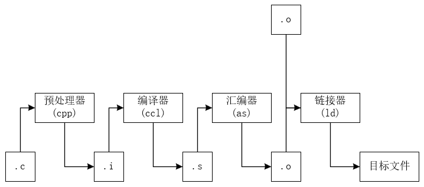
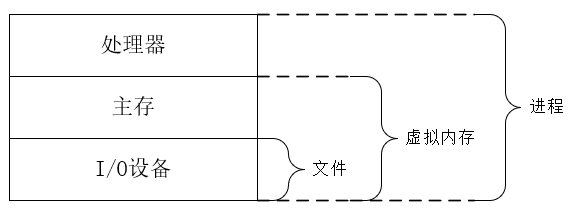
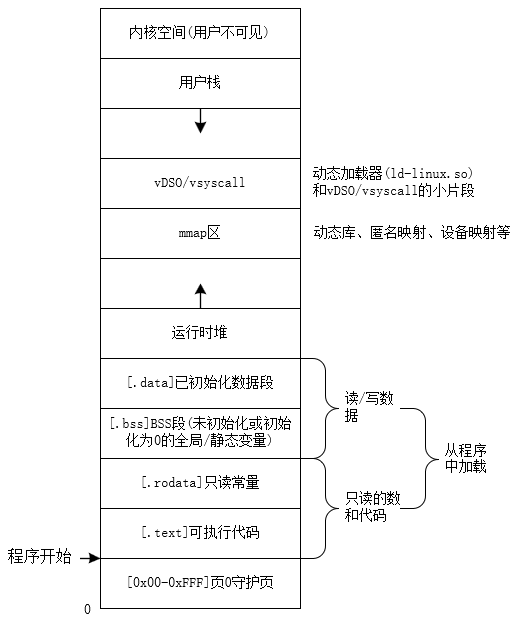

# 操作系统
## 功能
- 防止硬件被失控的应用程序滥用。
- 向应用程序提供简单一致的机制来控制复杂而大不相同的低级硬件设备。
## 抽象层次
## 信息
- **信息=位+上下文。**
	- 在计算机中，一切数据本质上都是一串二进制位序列。
	- 区分不同含义的数据的方法是正确解释其上下文(格式、约定、元信息)。
- **文件类型**
	- **文本文件**
		- 只包含ASCII(UTF-8)可打印字符，用文本编辑器即可读取。
	- **二进制文件**
		- 包含不可打印位，按特定格式组织.
- 只由ASCII字符组成的文件称为**文本文件**。
- 数字的机器表示方法是对真值的有限近似值。
## 程序的翻译
- 在运行前，高级语言源程序必须经过多个阶段的“翻译”与“打包”，才能变成机器可直接执行的格式。

- **编译**，源代码在称为程序前，需要将语句转化为一系列低级的机器语言指令(**汇编代码**)。然后这些指令按照一种称为**可执行目标程序**的格式打包，并以二进制磁盘文件存放。
	- **编译器驱动程序**，用于将源文件转化为目标程序。
		- 目标程序也称为**可执行目标程序**。
### 编译驱动层
- `gcc`,`clang`等命令程序的作用
	- 解析命令行参数(编译选项、宏定义、优化级别、头文件路径、库路径等)
	- 按顺序调用预处理器、前端、后端、汇编器、链接器
	- 在开启LTO、PGO、静态分析等高级功能时，插入中间表示(IR)优化环节。
### 编译
- **编译系统**：由预处理器、编译器、汇编器、链接器构成。

#### 各阶段介绍
##### 预处理阶段
- **预处理器**(cpp)处理预处理命令(以#开头的命令)修改源文件。
	- `#include<>`
		- 将目标文件内容插入到此处。
	- `#define FLAG VALUE`
		- 使用VALUE对FLAG进行替换。
	- `#if/#indef`
		- 条件编译。
	- **预编译头**(PCH)
		- 提前编译常用头文件，减少`#include`的解析成本。
- 得到.i为拓展名的文件。
##### 编译阶段
- **编译器**(ccl)将高级语言编译成为汇编语言。
	1. **词法分析**
		- 将字符序列分解为记号(token)
	2. **语法分析**
		- 生成抽象语法树(AST)
	3. **语义分析**
		- 类型检查、符号表管理
	4. 生成中间表示(IR)，进行中端优化(常量折叠、死代码消除、内联展开等)。
		- 现代编译器(gcc、clang)广泛使用IR(GIMPLE/LLVM-IR)做跨文件、跨模块优化(LTO)。
	5. 后端将IR转为汇编代码
- 得到.s为拓展名的汇编源文件。
##### 汇编阶段
- **汇编器**(as)将汇编语言指令翻译为机器码。
- 得到.o为拓展名的**可重定位目标文件**。
	- 是一个二进制文件。
	- 结构
		- .text/.data/.bss段
		- 符号表(定义与引用)
		- 重定位记录
##### 链接阶段
- **链接器**(ld)将代码编译得到的可重定位目标程序与其它用到的预编译好的目标程序合并。
	1. 合并多个.o文件
	2. 搜索并解包**静态库**(.a)。
	3. 解析并绑定动态库依赖(.so/.dll/.dylib)
	4. 符号解析、重定位计算
	5. 生成可执行文件(ELF、Mach-O、PE)或共享库。
- 动态链接与静态链接
	- 动态链接节省磁盘空间、可共享库
	- 静态链接启动速度更快、部署更简单、但体积更大。
- **运行时加载**
	- 可执行文件启动时，由**系统动态加载器**负责装载依赖的共享库，并完成进一步的重定位。
#### 了解编译系统工作原理的作用
- 优化程序性能。
	- 根据编译原理选择合适的代码结构、编译选项，可显著提升运行效率。
- 错误排查。
	- 理解各阶段输出，能快速定位编译/链接报错。
- 安全性
	- 掌握符号重定位、栈布局、动态库加载机制，有助于发现并防范缓冲区溢出、符号劫持等漏洞。
- 自动化与持续集成
	- 利用缓存、并行编译、静态扫描、构建高效稳定的CI/CD流水线。
## 操作系统的硬件管理
- 操作系统通过进程、虚拟内存、文件等抽象，隐藏底层硬件系统，为上层应用提供统一且安全的运行环境。

### 进程
- **进程**是操作系统对一个正在执行的程序的抽象。
- 操作系统保持跟踪进程运行所需的所有状态信息(**进程上下文**)。
- 每个进程都以为自己独占了CPU、内存和I/O设备。
#### 并发与上下文切换
- **并发运行**
	- 多个进程的指令在单个或多个CPU上交错执行。
- **上下文切换**
	1. 保存当前进程的寄存器、程序计数器、内存映射等状态到进程控制块(PCB)。
	2. 恢复下一个进程的PCB终稿保存的状态。
	3. 切换CPU执行流，新进程从上次停止处继续执行。
- 单个系统任意时刻只执行一个进程，多核系统可在不同核心上并行执行多个进程。
#### PCB与调度
- **进程控制块(PCB)**
	- 存放PID、寄存器、内存映射表、打开的文件描述符、优先级、状态等。
	- 是进程上下文的载体。通常会记录所有上下文信息以及额外的管理信息。
- 调度
	- 操作系统内核通过调度算法(CFS、实时调度)决定下一个运行的进程或线程。
	- 从一个进程到另一个进程的转换是由操作系统内核管理的。
	- 内核是操作系统代码常驻主存的部分。内核不是一个独立的进程，是系统管理全部进程所用代码和数据结构的集合。
	- 内核需要操作系统完成某些操作时，会执行**系统调用**，将控制权传给内核，然后内核执行被请求的操作并返回进程。
### 线程
- 一个**线程**是进程内可独立调度和执行的最小单位。
- 一个进程可以包含一个或多个线程(主线程和子线程)。其**共享同一进程的虚拟地址空间和全局数据，但拥有各自的执行栈和寄存器上下文。**
	- **共享**：代码段、全局/静态变量、堆内存、打开的文件描述符、信号处理函数等。
	- **独立**：线程私有的栈、寄存器状态、线程局部存储(TLS)、线程ID、调度信息。
	- 多线程之间共享内存，使得通信高效，但引入了**竞争条件**和**内存可见性**问题。
		- 需使用互斥锁、读写锁、条件变量、信号量等同步原语，或原子操作和内存屏障来保证线程安全。
#### 进程与线程的切换开销
- **线程切换**
	- 只需要保存/恢复少量上下文(寄存器、栈指针、TLS指针等)，不涉及页表或虚拟地址空间的切换、也无需刷新TLB，开销较小。
- **进程切换**
	- 需要保存/恢复完整的内存映射(CR3)和更全的PCB,上下文切换成本高。
#### 线程模型
- **用户态线程**
	- 由用户库管理，切换无需内核参与，但若某线程阻塞、整个进程会阻塞。
- **内核线程**
	- 由操作系统调度器管理，每个线程均可独立调度和阻塞、开销略高但功能更完善。
- **混合模型**
	- 用户线程映射到少量内核线程，是两者的折中。
### 虚拟内存
- 为每个进程提供独立且连续的“假象”主存空间，称为**虚拟地址空间**。
- 每个进程都认为自己独占了从地址0x0到最大虚拟地址的整片内存，实际上物理内存由操作系统和硬件（MMU）动态映射管理。
#### 实现机制
- **地址转换**
	- CPU生成的每个虚拟地址都要经过MMU(内存管理单元)查页表来转换成物理地址。
	- 常用多级页表+TLB(快表)加速转换。
- **存储后备**
	- 主存作为缓存，磁盘作为后被存储。
	- 当物理内存不足时，操作系统将不常用的页换出到磁盘；再次访问时再换入。
#### 地址空间布局(x86_64 Linux)

- 地址空间最上面的区域是保留给操作系统中的代码和数据，对所有进程一样。
- 地址空间的底部区域存放用户进程定义的代码和数据。
- 每个进程看到的虚拟地址空间由大量准确定义的区构成，每个区都有专门的功能。
	- 守护页
		- 地址0x0附近通常不映射。任何NULL访问都会立即陷入页错误。
	- 程序代码和数据
		- 代码是从同一固定位置开始，紧接着的是和C全局变量相对应的数据位置。
		- 代码和数据区是直接按照可执行目标文件的内容初始化。
		- \[.text\]和\[.rodata\]是按照ELF程序头中`p_vaddr`精确映射，权限通常为只读或可执行。使用 `const` 修饰的全局变量、字面量、字符串都存储在\[.rodata\]中。
		- \[.data\]存放已初始化的全局变量；\[.bss\]存放初始为零的全局变量。二者在进程启动时连续映射。
	- 堆
		- 代码和数据区后紧接的是运行时堆。代码和数据区在进程一开始运行时就被指定了大小。
		- **由低地址向高地址增长。**初始大小由可执行文件头指定；运行时通过`brk()`调整(增长或收缩)。
	- mmap区域
		- 包括共享库、匿名映射、文件映射。
		- 默认从`vm.mmap_base`地址向高地址分配；可通过`MAP_FIXED`强制放置。
	- 栈
		- 位于用户虚拟地址空间顶部的是**用户栈**，编译器用其实现函数调用。
		- **由高地址向低地址增长**。初始大小由线程属性或ELF头`StackSize`决定。
		- 用户栈在程序执行期间可以动态地扩展和收缩。每当调用一个子函数时，栈就会增长。当从子函数返回时，栈就会收缩。
		- 缺页时自动分配新页面。超出最大栈大小触发栈溢出。
	- 内核虚拟内存
		- 地址空间顶部的区域是为内核空间。
		- 对所有用户态进程都映射同一份内核代码/数据，权限为内核态才可访问。
		- 切换到内核时通过系统调用或中断实现。
### 文件
- 在操作系统中，文件被抽象为**字节序列**，上层应用通过**偏移量**对文件进行读写，无需关心底层存储介质的组织方式。
- 系统中的所有输入输出都通过Unix I/O的系统函数调用读写文件来实现的。
#### 文件描述符与文件表
- **文件描述符表**
	- 每个进程私有，索引到当前进程可访问的开发文件列表。
- **系统全局文件表**
	- 维护所有进程打开的文件实例，包括文件位置指针、访问模式、引用计数等。
- **i-node表**
	- 存放文件元数据(权限、所有者、大小、块映射等)，多个文件描述符或硬链接可指向同一个i-node。